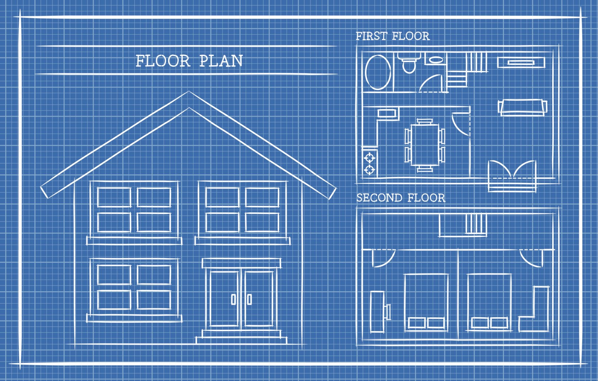

# Classes in Python

I will use my past experiences with Object-Oriented Programming
to describe classes. Classes are objects with a clear structure
that can be persisted and called by other files and subsequently by functions.

Classes have their own characteristics that are inherited once the class is instantiated.

Consider the example of a house as a class, where each characteristic
is a class attribute, such as size, height, number of rooms, and so on:



A class is composed of three parts:

1. Class definition: its name.
2. Class constructor `__init__` that is initialized once the class
is instantiated.
3. The methods: class behaviors, things the class needs to do

## Example of Class

Follow an example of how to implement a class for the object `Car`:

```python
# 1. THE CLASS (The Blueprint)
class Car:
    # 2. THE CONSTRUCTOR (Initial Setup)
    # 'self' refers to the specific object being created right now
    def __init__(self, brand, color):
        self.brand = brand  # Attribute: Data it HAS
        self.color = color  # Attribute: Data it HAS
        self.is_running = False

    # 3. METHODS (Behaviors)
    # Actions the object CAN DO
    def start_engine(self):
        self.is_running = True
        print(f"The {self.brand} goes Vroom!")

# --- USING THE CLASS ---

# Create Objects (Instances)
my_car = Car("Toyota", "Black")
your_car = Car("Ferrari", "Red")

# Access Attributes
print(my_car.color)  # Output: Black

# Use Methods
my_car.start_engine() # Output: The Toyota goes Vroom!
```
