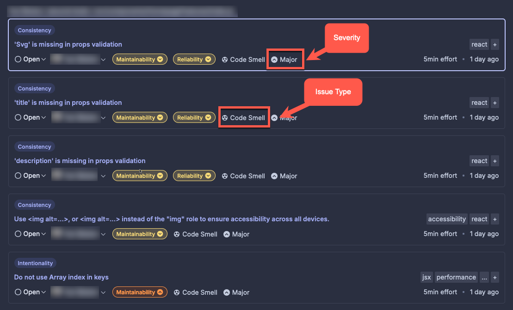
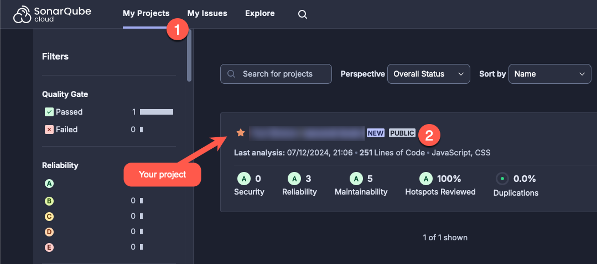

# Improving code quality with Sonar Cloud

During the software development lifecycle, code quality must be a step to be considered, in a recurrent way through iterations, where code smells and bugs are resolved along the way.

SonarSource has a [SaaS (Software as a Service)](https://en.wikipedia.org/wiki/Software_as_a_service) solution that helps developers with this important step with zero configuration. Using SonarCloud, your [CI/CD](https://en.wikipedia.org/wiki/CI/CD) has a dedicated step to scan your code and present you with key information:

    Where is the code located?
    Why is this an issue?
    How can I fix it?

The image below presents an example of issues after a scan on my project:

# How do I scan my project?

First, log into https://www.sonarsource.com/products/sonarcloud/signup/, and select what DVCS (distributed version control system) your code is located in; in my case, it is on GitHub.

Second, create your organization into SonarCloud; that can be your GitHub user. Finally, select the repository you want to scan, and voilà! 

